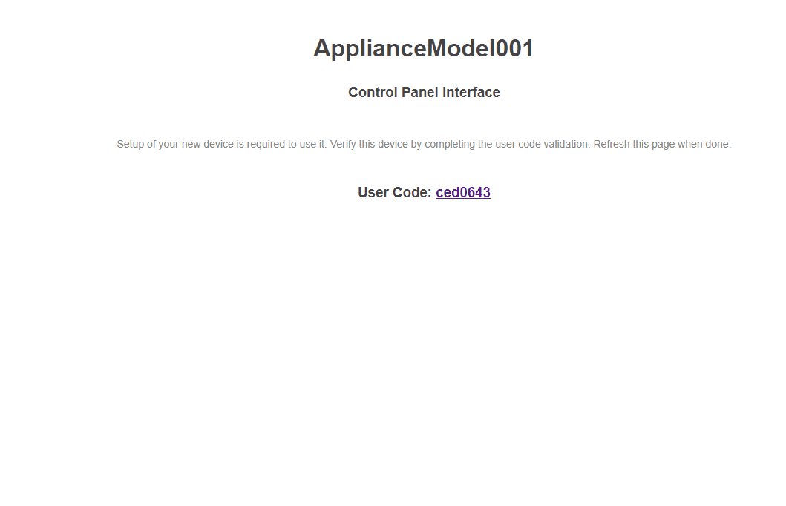

# Device Code Flow for MindTouch

Based on <https://tools.ietf.org/html/rfc8628#section-3.4>, the following example demonstrates the device code flow for the popular ESP8266 embedded device for a MindTouch site.

## Example

Wifi setup uses this project: <https://github.com/tzapu/WiFiManager>

Example workflow:


## Try it yourself

Update the `MindTouchDeviceCodeFlowAppliance.ino` with MindTouch's device code arguments

``` cpp
const char *AUTH_ID = "-";
const char *AUTH_DOMAIN = "-";
const char *AUTH_DEVICE_KEY = "-";
const char *AUTH_DEVICE_SECERT = "-";
```

## Todo

- [ ] Configuration file
- [ ] Debug mode
- [ ] Refresh token logic
- [ ] Memory optimizations
- [ ] SSL Fingerprinting
- [ ] Better UI/UX
